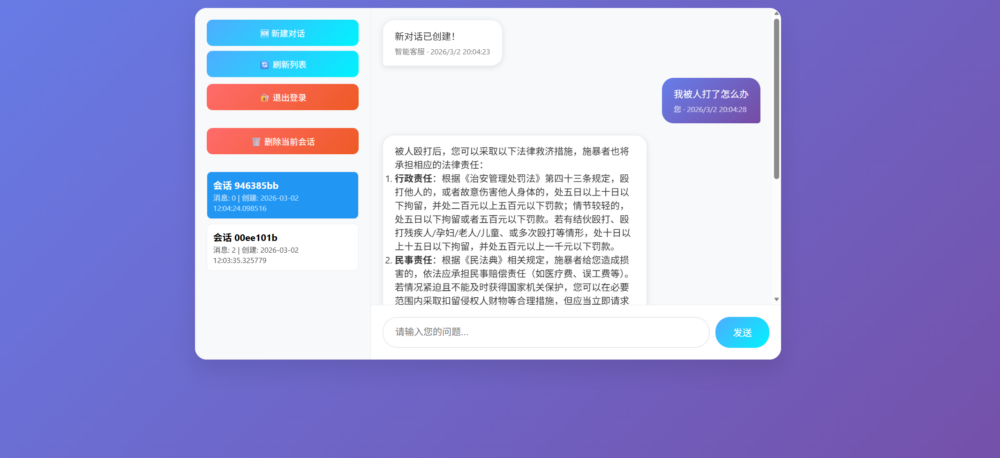

# 项目描述
基于RAG的法律AI助手，主要基于FastApi与langraph、async构建，基于redis缓存聊天记录。本地部署embedding模型，远程大模型调用阿里百炼的api。
- **架构设计与性能突破**：设计分层并发策略：LLM API 调用采用 async/await 非阻塞协程以最大化 IO 吞吐。对于计算密集的 RAG 检索，“异步队列 + 子进程动态微批次”调度器，将离散请求聚合后分发至独立子进程池执行。
该机制有效规避了 Python GIL 瓶颈，触发 Embedding 模型的 GPU 矩阵并行与 Milvus 多核检索。同时引入显存异常捕获与自适应重试机制，在检测到资源瓶颈时自动触发批次拆分与指数退避策略，确保高负载下的服务连续性。Locust 压测表明，在 100 用户并发聊天场景下，系统平均响应时间从 36s 骤降至 9s（测试结果在test/result下）。
- **智能体流程编排 (LangGraph)**：构建基于 ReAct 模式的状态机，利用 Few-Shot Prompting 引导模型自主判断意图。实现口语化问题自动改写与检索策略动态路由，显著缩小用户查询与专业法条的语义鸿沟。
- **混合检索 (RAG)**：搭建 BM25 + 稠密向量 (Milvus) 双路召回架构，微调 Qwen3-0.6B 作为专用 Embedding 模型。
- **长上下文记忆管理**：基于 Redis List 构建高频缓存层，实施Token 阈值滑动窗口算法。对滑出窗口的历史对话进行实时摘要压缩，在有限 Context Window 内实现无限轮次对话记忆。


# 环境配置
## 1、ubuntu22.04 环境安装redis，mysql,可以在网上搜索相应的教程。 我的redis版本是8.0，mysql版本是8.0.45。
## 2、anaconda创建环境并执行
```
pip install -r requirements.txt
```
## 3、修改.env_temp文件为.env文件，主要写一个环境配置，具体参数在文件里面有相应描述，初次运行需要设置RE_BUILD = TRUE，在自己本地构建milvus.db向量库文件。

## 4、执行bash start.sh命令运行程序。


